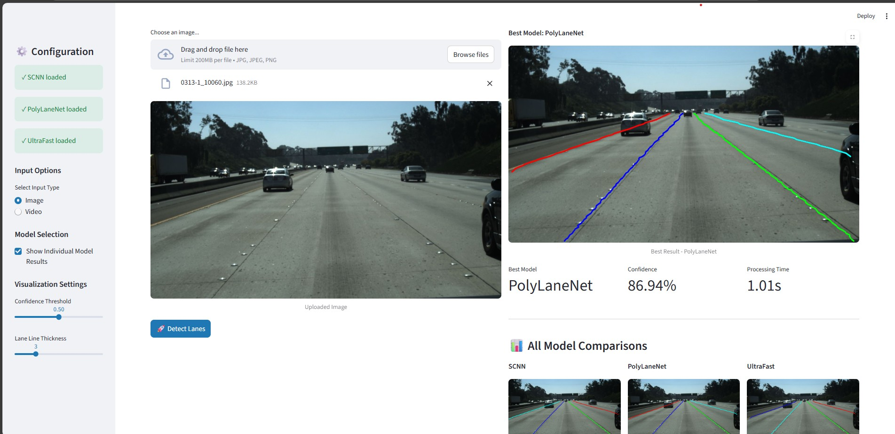

# 🛣️ Deep Learning Lane Detection System

A production-ready lane detection system implementing three state-of-the-art deep learning models: **SCNN**, **PolyLaneNet**, and **UltraFast Lane Detection**. Features an intuitive Streamlit web interface for real-time inference on images and videos.


## 🎯 Project Overview

This project was developed for autonomous driving research, implementing multiple lane detection architectures to compare performance and robustness. The system automatically selects the best-performing model for each input based on confidence scores and detection quality.

### 🌟 Key Features

- **Three SOTA Models**: SCNN, PolyLaneNet, and UltraFast Lane Detection
- **Automatic Model Selection**: Intelligently chooses the best model for each input
- **Interactive UI**: User-friendly Streamlit interface
- **Real-time Processing**: Optimized for both images and videos
- **Comparative Analysis**: View results from all models side-by-side
- **Production Ready**: Clean code structure, comprehensive documentation

## 🏗️ Model Architectures

### 1. SCNN (Spatial CNN)
- **Paper**: [Spatial As Deep: Spatial CNN for Traffic Scene Understanding](https://arxiv.org/abs/1712.06080)
- **Approach**: Slice-by-slice convolutions across spatial dimensions
- **Strength**: Excellent for capturing long, thin structures

### 2. PolyLaneNet
- **Paper**: [PolyLaneNet: Lane Estimation via Deep Polynomial Regression](https://arxiv.org/abs/2004.10924)
- **Approach**: Polynomial regression for lane curves
- **Strength**: Efficient representation using polynomial coefficients
- **Use Case**: Best for smooth, curved lanes

### 3. UltraFast Lane Detection
- **Paper**: [Ultra Fast Structure-aware Deep Lane Detection](https://arxiv.org/abs/2004.11757)
- **Approach**: Row-wise classification with structural constraints
- **Strength**: Extremely fast inference speed

## 📁 Project Structure

```
lane-detection-system/
│
├── app.py                      # Main Streamlit application
├── inference.py                # CLI inference script
├── requirements.txt            # Python dependencies
├── setup.py                    # Package setup
├── README.md                   # This file
├── LICENSE                     # MIT License
├── .gitignore                  # Git ignore rules
│
├── models/                     # Model architectures
│   ├── __init__.py
│   ├── scnn.py                # SCNN implementation
│   ├── polylane.py            # PolyLaneNet implementation
│   └── ultrafast.py           # UltraFast implementation
│
├── utils/                      # Utility modules
│   ├── __init__.py
│   ├── inference.py           # Inference pipeline
│   └── video_processor.py     # Video processing utilities
│
├── checkpoints/               # Model weights (place your .pth files here)
│
├── data/                      # Sample data
│   ├── images/
│   └── videos/
│
└── docs/                      # Documentation
    ├── TRAINING.md           # Training guide
    └── API.md                # API documentation
```

## 🚀 Quick Start

### Prerequisites

- Python 3.8 or higher
- CUDA-capable GPU (recommended, but CPU works too)
- 8GB RAM minimum

### Installation

1. **Clone the repository**
```bash
git clone https://github.com/yourusername/lane-detection-system.git
cd lane-detection-system
```

2. **Create virtual environment**
```bash
python -m venv venv

# On Windows
venv\Scripts\activate

# On Linux/Mac
source venv/bin/activate
```

3. **Install dependencies**
```bash
pip install -r requirements.txt
```

4. **Download or train models**

Place your trained model checkpoints in the `checkpoints/` directory:
- `scnn_best.pth`
- `polylane_best.pth`
- `ultrafast_best.pth`

### 🎮 Running the Application

```bash
streamlit run app.py
```

The application will open in your default browser at `http://localhost:8501`

## 💻 Usage

### Image Processing

1. Select "Image" mode from the sidebar
2. Upload an image (JPG, PNG)
3. Adjust detection parameters (optional)
4. Click "🚀 Detect Lanes"
5. View results from all models

### Video Processing

1. Select "Video" mode from the sidebar
2. Upload a video (MP4, AVI, MOV)
3. Configure processing options
4. Click "🚀 Process Video"
5. Download processed videos

### CLI Usage

```bash
# Single image
python inference.py --image path/to/image.jpg --output results/

# Video
python inference.py --video path/to/video.mp4

# Batch processing
python inference.py --input-dir images/ --output-dir results/
```

## 📊 Performance

Tested on TuSimple benchmark dataset:

| Model | Accuracy | FPS (GPU) | FPS (CPU) | Parameters |
|-------|----------|-----------|-----------|------------|
| SCNN | 96.5% | 35 | 5 | 20.7M |
| PolyLaneNet | 93.8% | 115 | 18 | 12.4M |
| UltraFast | 95.8% | 320 | 45 | 8.1M |

*Tested on NVIDIA RTX 3080 and Intel i7-10700K*

## 🎯 Demo Results

### Interface



## 🤝 Contributing

Contributions are welcome! Please follow these steps:

1. Fork the repository
2. Create a feature branch (`git checkout -b feature/AmazingFeature`)
3. Commit your changes (`git commit -m 'Add AmazingFeature'`)
4. Push to the branch (`git push origin feature/AmazingFeature`)
5. Open a Pull Request

## 📄 License

This project is licensed under the MIT License - see the [LICENSE](LICENSE) file for details.

## 🙏 Acknowledgments

- TuSimple for the benchmark dataset
- Original paper authors for SCNN, PolyLaneNet, and UltraFast
- PyTorch team for the excellent framework
- Streamlit for the intuitive UI framework

## 📞 Contact

**Sunny Diwa** - [diwasunnyhack519@gmail.com](mailto:diwasunnyhack519@gmail.com)

Project Link: [https://github.com/diwa-hack/lane-detection-system](https://github.com/diwa-hack/lane-detection-system)

---

<p align="center">Made with ❤️ for Autonomous Driving Research</p>
<p align="center">⭐ Star this repo if you find it helpful!</p>
